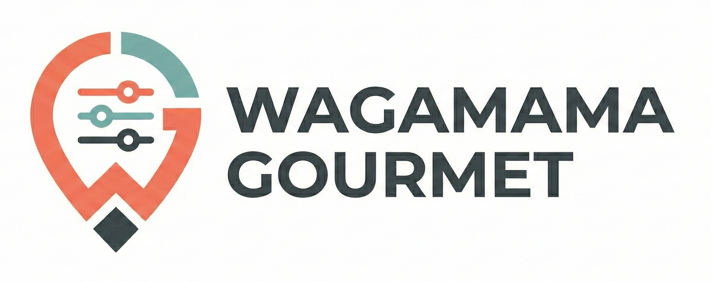

# プロダクト名 
Wagamama Gourmet（わがままグルメ）

## チーム名
チーム25 わがままグルメ

## 背景・課題・解決されること

関西の街中で食事先を探すとき、「安さ」「雰囲気」「早さ」など人によって条件が異なり、既存の検索は入力項目が多くて比較が大変です。  
特にハッカソン会場のような現地利用では、スマホですぐに判断できることが重要です。  

Wagamama Gourmet は、スライダーとプリセット（例: 金欠モード/デートモード/急ぎモード）を使って、地図上の候補をリアルタイムで可視化します。  
さらに、ブラウザで動作するスマホファースト設計と、バックエンド未接続時のフォールバック（ダミーデータ表示/ローカルチャット応答）により、依存関係がそろっていない環境でも体験を継続できます。

## プロダクト説明

「今のわがまま」に合わせて、飲食店候補の見え方が即座に変わる地図アプリです。

- スマホ最適化したUIで、片手操作でも条件調整しやすい
- スライダー変更に応じて店舗スコアを即時計算し、地図ピンの強調度を更新
- プリセットでシーン別に一発切替（初見ユーザーでも迷いにくい）
- チャット入力から条件解釈し、候補絞り込みを支援
- バックエンド不調時でも、フロント側フォールバックでデモ継続可能

## 操作説明・デモ動画
[デモ動画はこちら](https://www.youtube.com/watch?v=fbzGp0XJGq8)

### 基本操作
1. トップ画面で地図と候補店舗を表示
2. スライダーを動かして重み（価格/アクセス/評価/雰囲気/提供速度）を調整
3. プリセットを選択してシーン別に条件を一括変更
4. 気になる店舗を選択し、地図上で比較
5. チャットで要望を入力し、追加の絞り込み提案を受ける

### デモ時の想定導線（約1分）
1. 金欠モードを選択
2. ランキング変化を確認
3. デートモードへ切替
4. 候補変化を見せて体験価値を説明

## 注力したポイント

### アイデア面
- 「検索条件入力」ではなく「感覚的な重み調整」で探せる体験設計
- 同じエリアでもシーンに応じて最適解が変わることを可視化
- 30秒で価値が伝わるデモ導線を優先

### デザイン面
- スマホファーストのレイアウトと操作導線
- 地図上の変化を中心にした、説明不要で伝わるUI
- スライダー/プリセット/チャットを役割分担し、迷いを減らす情報設計

### その他
- フロントとバックのスコア計算ロジック整合性を確保
- API障害時フォールバックを実装し、デモの耐障害性を向上
- 主要機能のテストを用意し、短期間でも品質を担保

## 使用技術

- Frontend: React, TypeScript, Vite, Tailwind CSS, MapLibre GL JS, framer-motion
- Backend: FastAPI, Python, Pydantic, Uvicorn
- Database: Supabase (PostgreSQL)
- API/連携: Google Maps Routes API（徒歩アクセススコア事前計算）
- Test/Lint: pytest, ESLint
- その他: npm, Git/GitHub

<!--
markdownの記法はこちらを参照してください！
https://docs.github.com/ja/get-started/writing-on-github/getting-started-with-writing-and-formatting-on-github/basic-writing-and-formatting-syntax
-->
